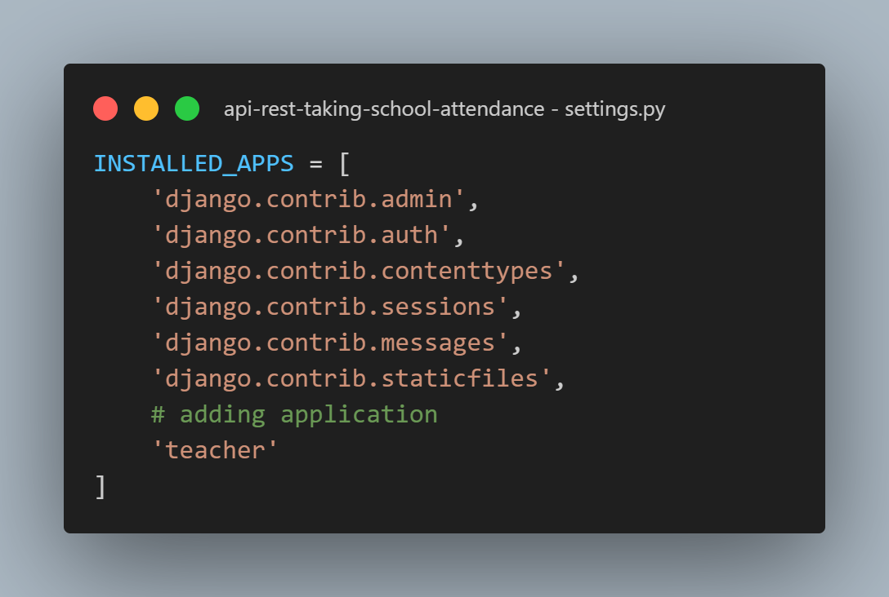
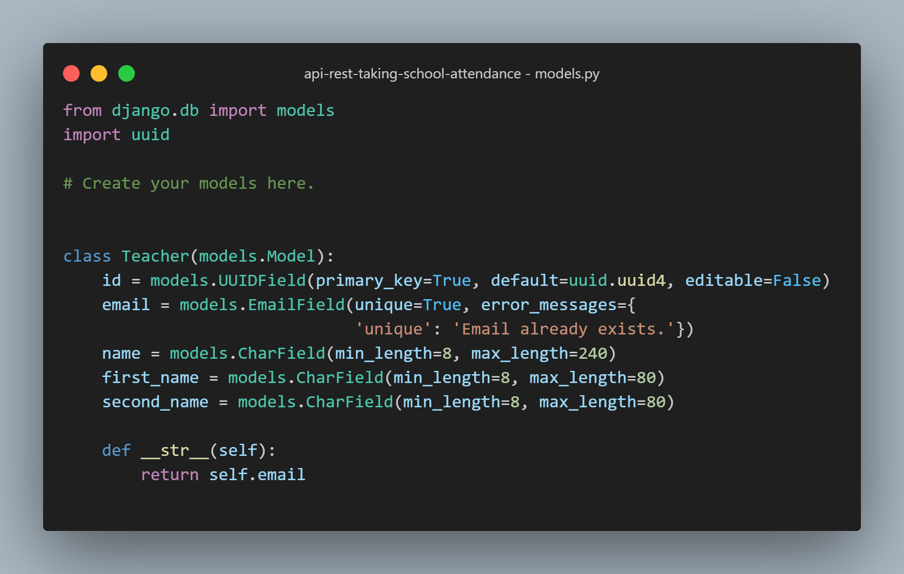
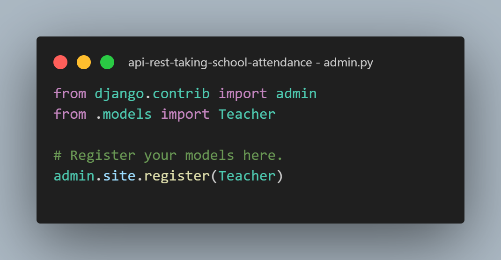

# api-rest-taking-school-attendance

## steps to initialize the project

---

:heavy_check_mark: create the virtual environment for the api from anywhere
`python -m venv (path_name)\(name_env)`
Or from the current folder
`python -m venv name_env`
:heavy_check_mark: Activate the virtual environment to perform installations
`.\(name_env)\Scripts\activate`
:heavy_check_mark: Perform the installation of requirements.txt if it exists
`pip install requirements.txt`
Otherwise, do the following

---

:heavy_check_mark: Install the following
`pip install Django psycopg2 django-ninja django-cors-headers PyJWT`
:heavy_check_mark: To initialize the project
`django-admin startproject (project_name) .`
:heavy_check_mark: We create the modules of our API
`django-admin startapp (module_name)`
:heavy_check_mark: We add the modules in the application settings

:heavy_check_mark: We configure the database
:heavy_check_mark: Create the models of our modules in `models.py`

:heavy_check_mark: we add the model created in `admin.py`

:heavy_check_mark: We carry out the general migration
`python manage.py migrate`
:heavy_check_mark: We perform the migration for the model
`python manage.py makemigrations`
:heavy_check_mark: We perform another migration so that the model migration is applied to the database
`python manage.py migrate`
:heavy_check_mark: We proceed to create the superuser
`python manage.py createsuperuser`
:heavy_check_mark: We run the server
`python manage.py runserver`
:heavy_check_mark: Create a txt with the names of the installed libraries
`pip freeze > requirements.txt`
